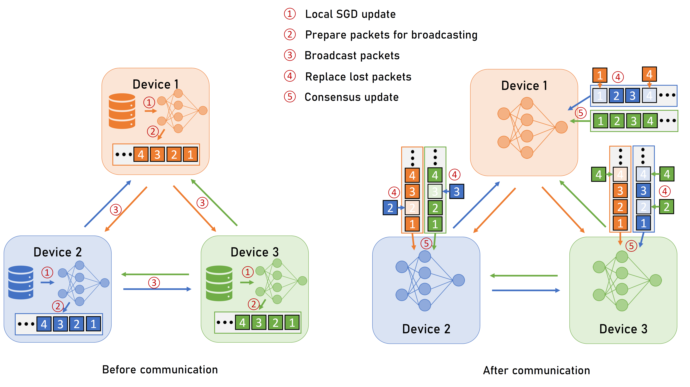

# Decentralized Federated Learning with Unreliable Communications
## Abstract
Decentralized federated learning, inherited from decentralized learning, enables the edge devices to collaborate on model training in a peer-to-peer manner without the assistance of a central server. However, existing decentralized learning frameworks usually assume perfect communications among devices, where they can reliably exchange messages, e.g., gradients or parameters. But the real-world communication networks are prone to packet loss and transmission errors due to channel distortion and interference. Transmission reliability comes with a price. The commonly-used solution is to adopt a reliable transportation layer protocol, e.g., transmission control protocol (TCP), which leads to significant communication overhead and reduces connectivity among devices. For a communication network with a lightweight and unreliable communication protocol, user datagram protocol (UDP), we propose a robust decentralized stochastic gradient descent (SGD) approach, called Soft-DSGD, to address the unreliability issue. Soft-DSGD updates the model parameters with partially received messages and optimizes the mixing weights according to the link reliability matrix of communication links. We prove that the proposed decentralized training system, even with unreliable communications, can still achieve the same asymptotic convergence rate as vanilla decentralized SGD with perfect communications. Moreover, numerical results confirm the proposed approach can leverage all available unreliable communication links to speed up convergence.

## Run experiments
Decentralized training with retransmittion (baseline).
~~~
python main.py --communication_mode TCP --num_workers 16
~~~
Decentralized training with unreliable communications, uniform weights (proposed)
~~~
python main.py --communication_mode UDP --num_workers 16 --weights_type UNI
~~~
Decentralized training with unreliable communications, optimized weights (proposed)
~~~
python main.py --communication_mode TCP --num_workers 16 --weights_type OPT
~~~
